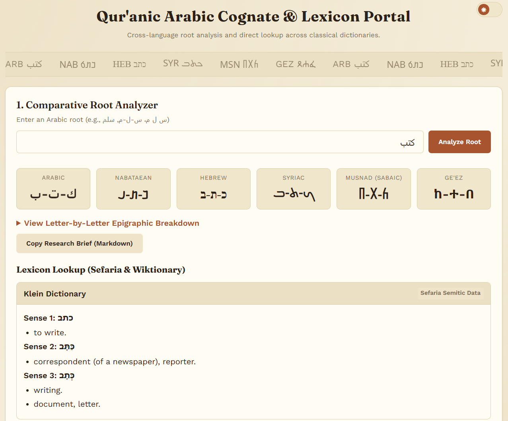
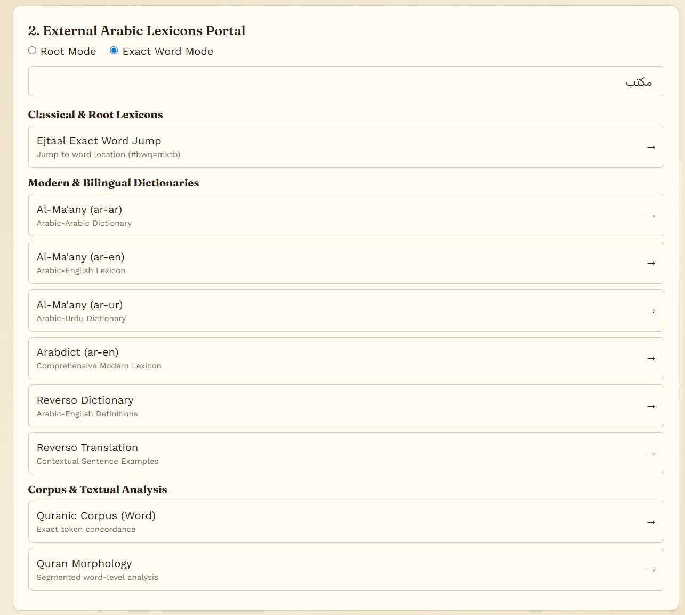

# README

# Qur'anic Arabic Cognate & Lexicon Portal

This tool is designed to help you uncover the deeper meanings of Qur'anic words by connecting them to their sister language, Hebrew. Because Arabic and Hebrew are literal sisters from the exact same Semitic family tree, thousands of their words share identical origins. While classical Arabic dictionaries often narrowed a word down to specific regional uses, Hebrew frequently preserved older, broader shades of meaning that got lost over time.

Instead of spending hours cross-referencing multiple heavy lexicons on your own, this app automates the entire research process. You simply type in a Qur'anic Arabic root, and the tool instantly identifies its corresponding Hebrew form. It then fetches real, live dictionary definitions directly from trusted lexicons, bringing hidden historical insights right to your screen in seconds.

## What it does

### 1. Root Analyzer

Type in an Arabic root (e.g. `موت`, `كتب`, `سلام`, `ملك`) and the tool:
- Works out its Hebrew, Syriac, Nabataean, Musnad (Sabaic), and Ge’ez equivalents, based on the regular sound shifts between these languages.
- Looks up the Hebrew form in real dictionaries (Sefaria’s lexicon database and Wiktionary) and shows you the definitions.
- Shows a letter-by-letter table explaining exactly how each Arabic letter maps to each other language, and why.
- Lets you copy the whole result as a Markdown summary.

**Note:** the Hebrew/Syriac/etc. forms are calculated from known sound-change rules, not looked up from a list of confirmed real words. If a dictionary lookup comes back empty, that guessed form may simply not exist, try a related root instead.

### 2. Arabic Lexicons Portal

Type in a root or word and get direct links to look it up in the major Arabic dictionaries and Qur’an databases, instead of searching each one yourself:
- Lane’s Lexicon / Hans Wehr (via Ejtaal)
- Al-Ma’any (Arabic-Arabic, Arabic-English, Arabic-Urdu)
- Arabdict and Reverso
- The Quranic Arabic Corpus, Quran.com, and Quran Morphology

You can switch between “Root” mode and “Exact Word” mode depending on what you’re looking up.

## Using it

Access the web portal directly in your browser:  
<a href="https://barqx.github.io/quran-cognate-lexicon" target="_blank">https://barqx.github.io/quran-cognate-lexicon</a>

- A modern web browser (Chrome, Firefox, Safari, Edge, etc.)
- An internet connection (for dictionary lookups)

That's it. Nothing to install, nothing to configure.

## Look and feel

Light mode by default, with a dark mode toggle in the top corner. Your choice is remembered next time you open it. Works on phones too.

## License

MIT — see [LICENSE](LICENSE). The dictionary definitions come from Sefaria and Wiktionary and belong to them, not to this project.
